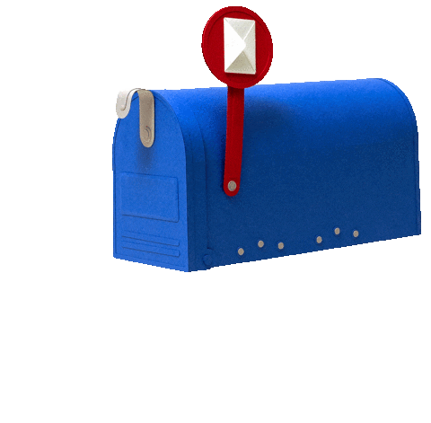
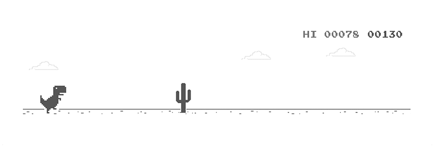

<div align="center">

<br>

# Hi, I'm Ahmed Hossam

### Developer | Tech Learner | Problem Solver


</div>

<hr>

## About Me

-  I enjoy building useful projects and learning new technologies.
-  I like exploring software, tools, and clean development workflows.
-  Ask me about programming, tech, or any idea you want to build.
-  This is my GitHub profile space: **Ahmed-hub-01**.
-  Always learning, always improving.

## Tools I Use


```js
const ahmedHossam = {
  name: "Ahmed Hossam",
  role: "Developer",
  interests: ["Programming", "Technology", "Problem Solving"],
  currentlyLearning: ["Web Development", "GitHub"],
  goal: "Build useful projects and keep improving every day"
};
```

## GitHub Stats

<div align="center">


</div>

<hr>

<div align="center">

**Thanks for visiting my profile**



</div>
